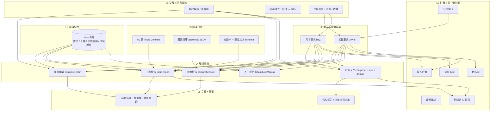
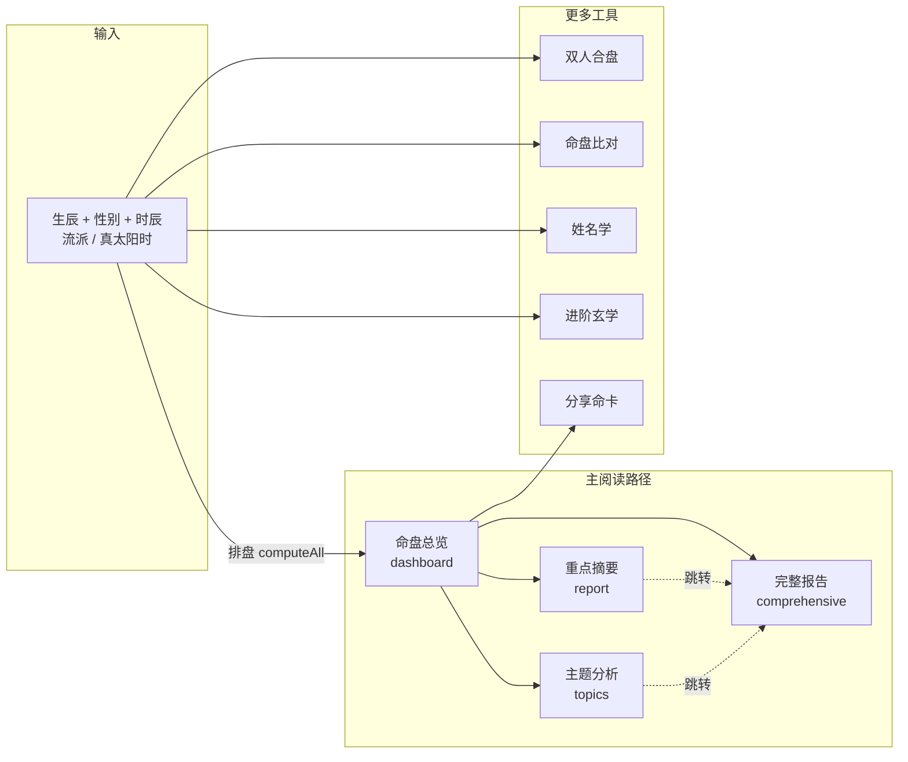
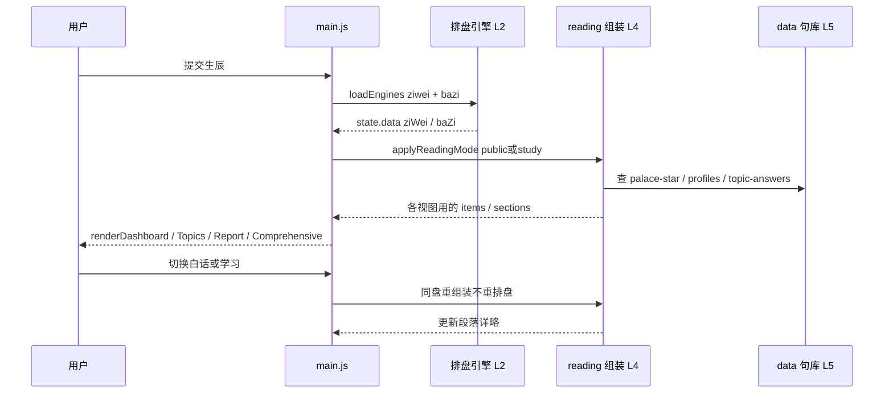
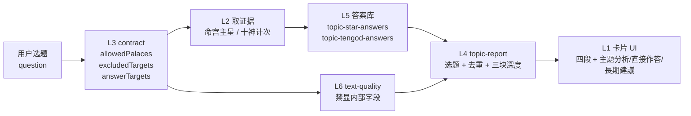

# synced from 10_产品逻辑分层图.md
# SOURCE: c:\Users\win\Desktop\八字\xciv参考重构

```mermaid
flowchart TB
  subgraph L7["L7 扩展工具 · 懒加载"]
    syn["双人合盘"]
    cmp["命盘比对"]
    nam["姓名学"]
    meta["进阶玄学"]
    share["分享命卡"]
    ai["复制给 AI 提示"]
  end

  subgraph L1["L1 交互与信息架构"]
    nav["侧栏导航 / 多视图"]
    mode["阅读模式：白话 ↔ 学习"]
    form["生辰表单 / 流派 / 收藏"]
  end

  subgraph L6["L6 呈现与质量"]
    qual["标题去重 · 相似度 · 禁显字段"]
    learn["宫位学习 / 流年学习进度"]
  end

  subgraph L4["L4 解读组装"]
    plain["重点摘要 compose-plain"]
    topic["主题报告 topic-report"]
    comp["完整报告 comprehensive"]
    manual["人生说明书 buildLifeManual"]
    dash["总览卡片 compose + luck + annual"]
  end

  subgraph L3["L3 阅读合同"]
    tc["60 题 Topic Contract"]
    asm["报告段序 assembly JSON"]
    card["四段卡 + 深度三块 schema"]
  end

  subgraph L5["L5 语料句库"]
    db[("data 句库\n宫星 / 十神 / 主题答案 / 拼装模板")]
  end

  subgraph L2["L2 输入与排盘事实"]
    zw["紫微事实 ziWei"]
    bz["八字事实 baZi"]
  end

  form --> zw
  form --> bz
  zw --> dash
  bz --> dash
  zw --> plain
  bz --> plain
  tc --> topic
  card --> topic
  asm --> comp
  db --> plain
  db --> topic
  db --> comp
  db --> manual
  zw --> topic
  bz --> topic
  zw --> comp
  bz --> comp
  zw --> manual
  plain --> qual
  topic --> qual
  comp --> qual
  dash --> learn
  nav --> plain
  nav --> topic
  nav --> comp
  nav --> dash
  zw --> syn
  bz --> syn
  zw --> nam
  bz --> meta
  dash --> ai
  topic --> ai
  share --> zw
```

```mermaid
flowchart LR
  subgraph input["输入"]
    F["生辰 + 性别 + 时辰\n流派 / 真太阳时"]
  end

  subgraph core["主阅读路径"]
    D["命盘总览\ndashboard"]
    R["重点摘要\nreport"]
    T["主题分析\ntopics"]
    C["完整报告\ncomprehensive"]
  end

  subgraph tools["更多工具"]
    S["双人合盘"]
    P["命盘比对"]
    N["姓名学"]
    M["进阶玄学"]
    H["分享命卡"]
  end

  F -->|"排盘 computeAll"| D
  D --> R
  D --> T
  D --> C
  R -.->|跳转| C
  T -.->|跳转| C
  F --> S
  F --> P
  F --> N
  F --> M
  D --> H
```

```mermaid
sequenceDiagram
  participant U as 用户
  participant M as main.js
  participant E as 排盘引擎 L2
  participant R as reading 组装 L4
  participant D as data 句库 L5

  U->>M: 提交生辰
  M->>E: loadEngines ziwei + bazi
  E-->>M: state.data ziWei / baZi
  M->>R: applyReadingMode public或study
  R->>D: 查 palace-star / profiles / topic-answers
  R-->>M: 各视图用的 items / sections
  M-->>U: renderDashboard / Topics / Report / Comprehensive
  U->>M: 切换白话或学习
  M->>R: 同盘重组装不重排盘
  R-->>M: 更新段落详略
```

```mermaid
flowchart LR
  Q["用户选题\nquestion"] --> C["L3 contract\nallowedPalaces\nexcludedTargets\nanswerTargets"]
  C --> Z["L2 取证据\n命宫主星 / 十神计次"]
  Z --> A["L5 答案库\ntopic-star-answers\ntopic-tengod-answers"]
  A --> T["L4 topic-report\n选题 + 去重 + 三块深度"]
  T --> U["L1 卡片 UI\n四段 + 主題分析/直接作答/長期建議"]
  C --> QF["L6 text-quality\n禁显内部字段"]
  QF --> T
```
