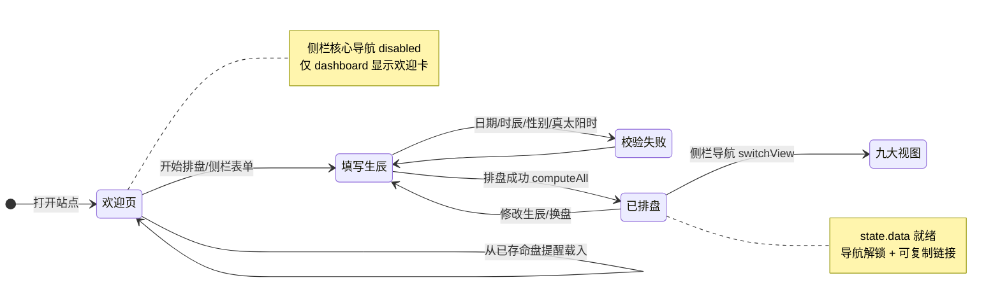
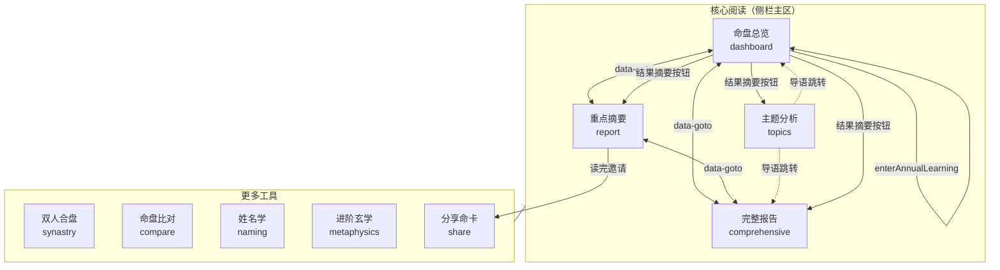
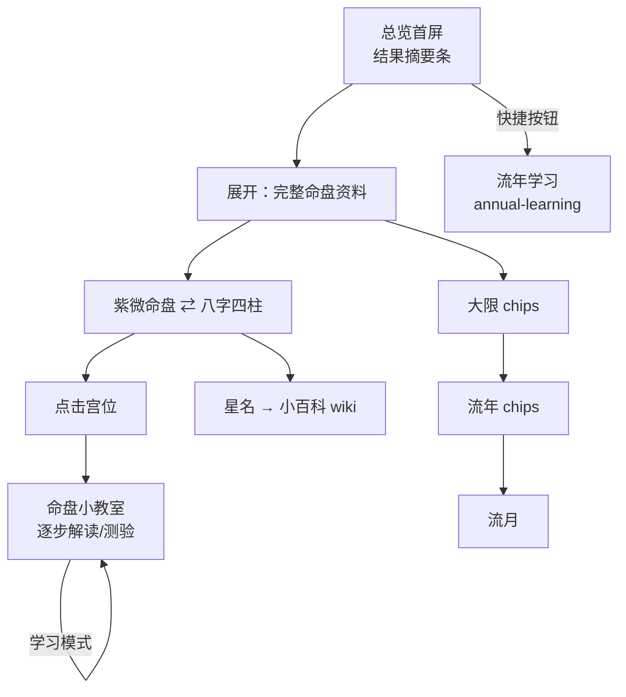
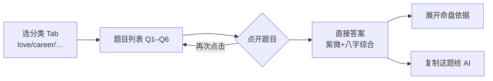
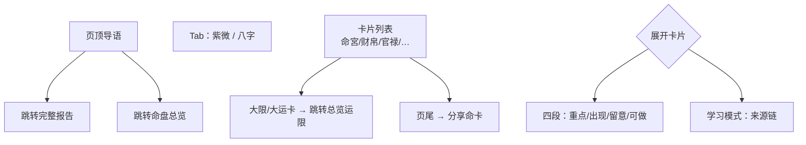
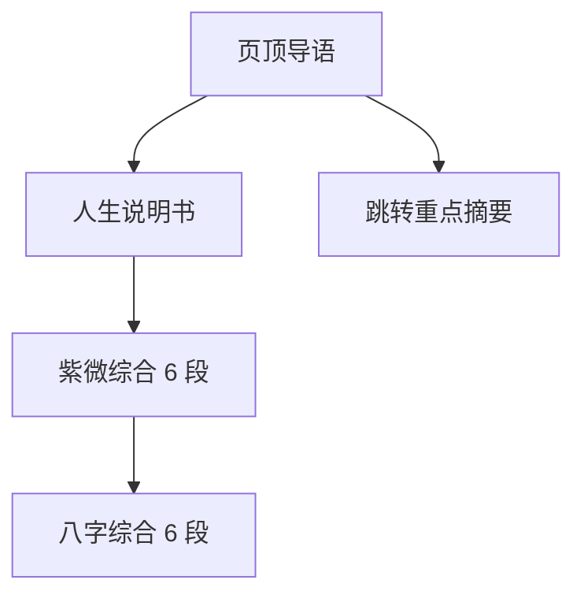
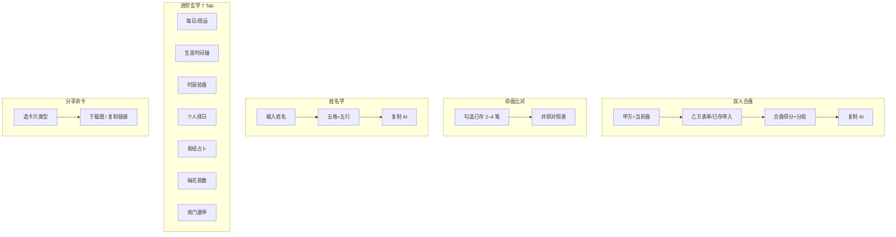
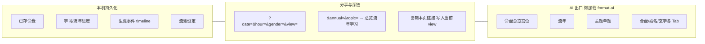

# synced from 11_用户交互路径图.md
# SOURCE: c:\Users\win\Desktop\八字\xciv参考重构

```mermaid
stateDiagram-v2
  direction LR
  [*] --> 欢迎页: 打开站点
  欢迎页 --> 填写生辰: 开始排盘/侧栏表单
  欢迎页 --> 欢迎页: 从已存命盘提醒载入
  填写生辰 --> 校验失败: 日期/时辰/性别/真太阳时
  校验失败 --> 填写生辰
  填写生辰 --> 已排盘: 排盘成功 computeAll
  已排盘 --> 填写生辰: 修改生辰/换盘
  已排盘 --> 九大视图: 侧栏导航 switchView
  note right of 欢迎页
    侧栏核心导航 disabled
    仅 dashboard 显示欢迎卡
  end note
  note right of 已排盘
    state.data 就绪
    导航解锁 + 可复制链接
  end note
```

```mermaid
flowchart TB
  subgraph core["核心阅读（侧栏主区）"]
    D["命盘总览\ndashboard"]
    T["主题分析\ntopics"]
    R["重点摘要\nreport"]
    C["完整报告\ncomprehensive"]
  end

  subgraph tools["更多工具"]
    Y["双人合盘\nsynastry"]
    P["命盘比对\ncompare"]
    N["姓名学\nnaming"]
    M["进阶玄学\nmetaphysics"]
    H["分享命卡\nshare"]
  end

  D <-->|data-goto| R
  D <-->|data-goto| C
  R <-->|data-goto| C
  T -.->|导语跳转| C
  T -.->|导语跳转| D
  R -->|读完邀请| H
  D -->|结果摘要按钮| T
  D -->|结果摘要按钮| R
  D -->|结果摘要按钮| C
  D -->|enterAnnualLearning| D

  core --- tools
```

```mermaid
flowchart TB
  D0["总览首屏\n结果摘要条"]
  D1["展开：完整命盘资料"]
  D2["紫微命盘 ⇄ 八字四柱"]
  D3["点击宫位"]
  D4["命盘小教室\n逐步解读/测验"]
  D5["大限 chips"]
  D6["流年 chips"]
  D7["流月"]
  D8["流年学习\nannual-learning"]
  D9["星名 → 小百科 wiki"]

  D0 --> D1
  D1 --> D2
  D1 --> D5
  D5 --> D6 --> D7
  D2 --> D3 --> D4
  D0 -->|快捷按钮| D8
  D2 --> D9
  D4 -->|学习模式| D4
```

```mermaid
flowchart LR
  A["选分类 Tab\nlove/career/…"] --> B["题目列表 Q1–Q6"]
  B --> C{点开题目}
  C -->|再次点击| B
  C --> D["直接答案\n紫微+八字综合"]
  D --> E["展开命盘依据"]
  D --> F["复制这题给 AI"]
```

```mermaid
flowchart TB
  T0["页顶导语"]
  T1["Tab：紫微 / 八字"]
  T2["卡片列表\n命宮/财帛/官禄/…"]
  T3{展开卡片}
  T3 --> T4["四段：重点/出现/留意/可做"]
  T3 --> T5["学习模式：来源链"]
  T0 --> T6["跳转完整报告"]
  T0 --> T7["跳转命盘总览"]
  T2 --> T8["大限/大运卡 → 跳转总览运限"]
  T2 --> T9["页尾 → 分享命卡"]
```

```mermaid
flowchart TB
  C0["页顶导语"]
  C1["人生说明书"]
  C2["紫微综合 6 段"]
  C3["八字综合 6 段"]
  C0 --> C1 --> C2 --> C3
  C0 --> C4["跳转重点摘要"]
```

```mermaid
flowchart TB
  subgraph syn["双人合盘"]
    S1["甲方=当前盘"] --> S2["乙方表单/已存带入"]
    S2 --> S3["合盘得分+分段"] --> S4["复制 AI"]
  end

  subgraph cmp["命盘比对"]
    P1["勾选已存 2–4 笔"] --> P2["并排对照表"]
  end

  subgraph nam["姓名学"]
    N1["输入姓名"] --> N2["五格+五行"] --> N3["复制 AI"]
  end

  subgraph meta["进阶玄学 7 Tab"]
    M1["每日/周运"]
    M2["生涯时间轴"]
    M3["时辰验盘"]
    M4["个人择日"]
    M5["易经占卜"]
    M6["梅花易数"]
    M7["奇门遁甲"]
  end

  subgraph share["分享命卡"]
    H1["选卡片类型"] --> H2["下载图 / 复制链接"]
  end
```

```mermaid
flowchart LR
  subgraph persist["本机持久化"]
    L1["已存命盘"]
    L2["学习/流年进度"]
    L3["生涯事件 timeline"]
    L4["流派设定"]
  end

  subgraph shareurl["分享与深链"]
    U1["?date=&hour=&gender=&view="]
    U2["&annual=&topic= → 总览流年学习"]
    U3["复制本页链接 写入当前 view"]
  end

  subgraph ai["AI 出口 懒加载 format-ai"]
    A1["命盘总览宫位"]
    A2["流年"]
    A3["主题单题"]
    A4["合盘/姓名/玄学各 Tab"]
  end

  persist --- shareurl
  shareurl --- ai
```
