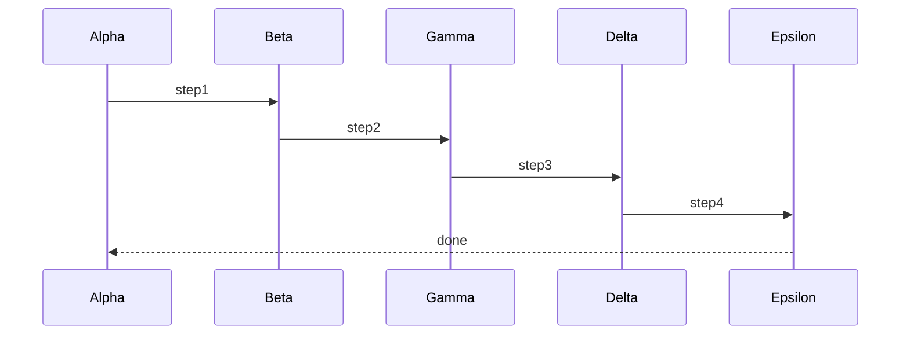

# wide sequence (XHS / PDF scale)

```mermaid
sequenceDiagram
  participant A as Alpha
  participant B as Beta
  participant C as Gamma
  participant D as Delta
  participant E as Epsilon
  A->>B: step1
  B->>C: step2
  C->>D: step3
  D->>E: step4
  E-->>A: done
```
